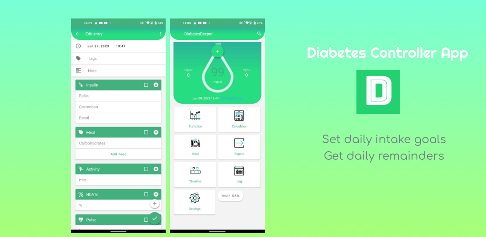

# 🩺 MyDiabetes  

   

  

**MyDiabetes** is an Android application designed to help people living with diabetes track, visualize, and manage their daily health data in a simple and reliable way.

It replaces the traditional paper diary and provides tools to record, monitor, and analyze blood glucose, insulin, carbohydrates, and other key health metrics. With an intuitive Material Design interface, users always have a clear overview of their condition — anytime, anywhere.

---

## ✨ Features

- Log your **blood glucose**, **insulin doses**, **carbohydrate intake**, **A1c**, **physical activity**, **weight**, **pulse**, **blood pressure**, and **oxygen saturation**  
- Choose **custom units** for glucose and insulin  
- **Graph view** for blood glucose trends  
- **Comprehensive logbook** and **statistics**  
- Integrated **makla (food)** database with thousands of items and nutrition info  
- **PDF and CSV export** for reports  
- **Local backup and restore**  
- **Reminders** for measurements or injections  
- **Estimated HbA1c** calculation  
- **Dark Mode** for better visibility and energy saving  
 

## 📖 About

### 🕓 History

The **MyDiabetes** project was started in **2019** as a personal learning challenge by *Yahia Guellab* — a developer passionate about both healthcare and technology.  
What began as a small side project to explore Android development soon grew into a complete health companion app used by many people worldwide.  

Today, MyDiabetes continues to evolve as a **community-driven, privacy-respecting, and completely free** tool for anyone who needs to monitor their diabetes efficiently.

---

### 🎯 Goals

The app is designed to:
- Help diabetics monitor and manage their condition on a daily basis  
- Replace handwritten glucose diaries with a digital, always-available alternative  
- Support doctors and diabetologists by providing clear, exportable patient data  
- Guarantee **privacy**: all personal data stays **only on the device**, unless the user explicitly exports or backs it up  
- Remain **accessible**, following the [Material Design Guidelines](https://material.io/design) and tested with [TalkBack](https://play.google.com/store/apps/details?id=com.google.android.marvin.talkback)  

> ⚠️ MyDiabetes is **not a medical device**. It is intended for **self-monitoring** under the guidance of a healthcare professional.  
> It should **not be used by minors** without parental supervision.

---

### 💡 Philosophy

MyDiabetes was created with three core values in mind:

- **Learning** – a way to explore Android development, architecture, and clean design  
- **Contribution** – giving something back to the open-source and health tech communities  
- **Passion** – for coding, for healthcare innovation, and for people  

The app will always remain **free, transparent, and ad-free**.  

---

## 👨‍💻 Development

### 🧠 Languages & Tools

- **Java** – core language for app logic  
- **XML** – user interface layouts  
- **SQLite + ORMLite** – lightweight and fast local database  
- **Butter Knife** – view binding  
- **Retrofit** – HTTP client for fetching nutrition data  
- **MPAndroidChart** – chart and graph rendering  
- **Picasso** – image loading and caching  

---

### 🧩 Architecture

MyDiabetes follows a hybrid structure based on **Model–View–Controller (MVC)** and **Domain-Driven Design (DDD)** principles.  
Each feature is organized as a self-contained module (e.g., “logbook”, “statistics”, “export”), while shared components such as networking or database utilities live in a `shared` package.

The next phase of development involves transitioning to **Model–View–ViewModel (MVVM)** for better encapsulation and testability.

---

### 🧪 Testing

Testing is done using:
- **JUnit** – unit testing  
- **Espresso** – UI and interaction testing  
- **Robolectric** – local Android environment simulation  

All new and modified features aim to include proper test coverage.

---

### ⚙️ Third-Party Libraries

MyDiabetes uses several open-source libraries with gratitude:

- [AndroidX](https://developer.android.com/jetpack/androidx)  
- [Material Components](https://material.io/components)  
- [Gson](https://github.com/google/gson)  
- [Retrofit](https://square.github.io/retrofit)  
- [MPAndroidChart](https://github.com/PhilJay/MPAndroidChart)  
- [Picasso](http://square.github.io/picasso)  
- [Butter Knife](http://jakewharton.github.io/butterknife)  
- [ORMLite](http://ormlite.com)  
- [EventBus](https://github.com/greenrobot/EventBus)  
- [Open Food Facts](http://world.openfoodfacts.org)  
- [PDFjet](http://pdfjet.com)  
- [OpenCSV](http://opencsv.sf.net)  
- [Joda-Time](https://www.joda.org/joda-time)  
- [JUnit](https://junit.org)  
- [Robolectric](http://robolectric.org)  

---

 

### Redistribution
In addition to the permissions and conditions of the **GPLv3**, redistribution requires prior written approval to ensure that forks or alternative releases do not conflict with existing distribution terms (e.g., Google Play policies).  
For redistribution requests, please contact: **[yahiaguellab74@gmail.com](mailto:yahiaguellab74@gmail.com)**  

---
 Copyright (C) 2019–2024
   Yahia Guellab
